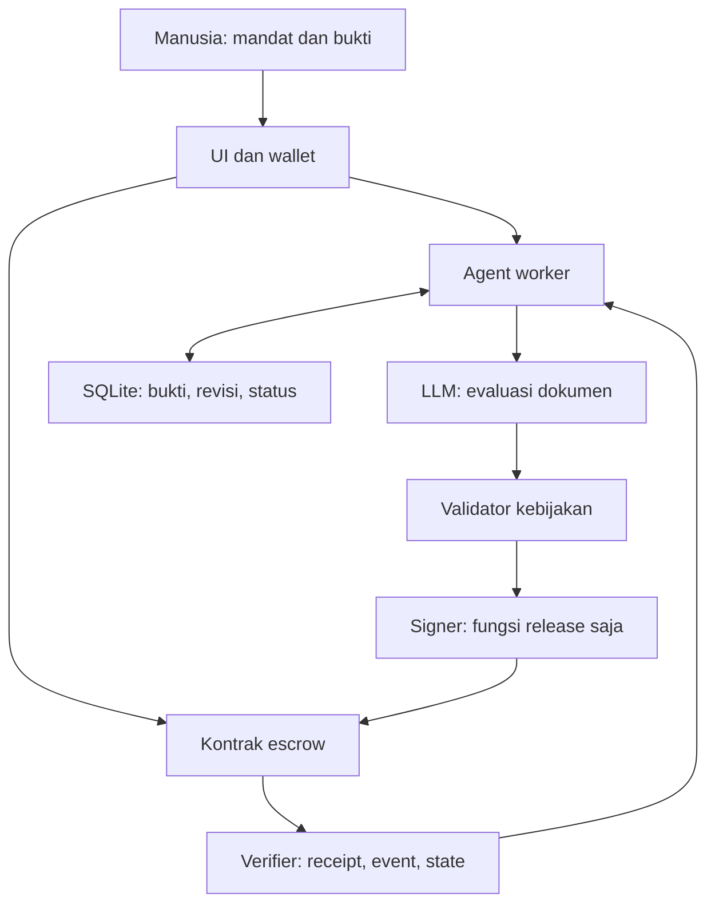
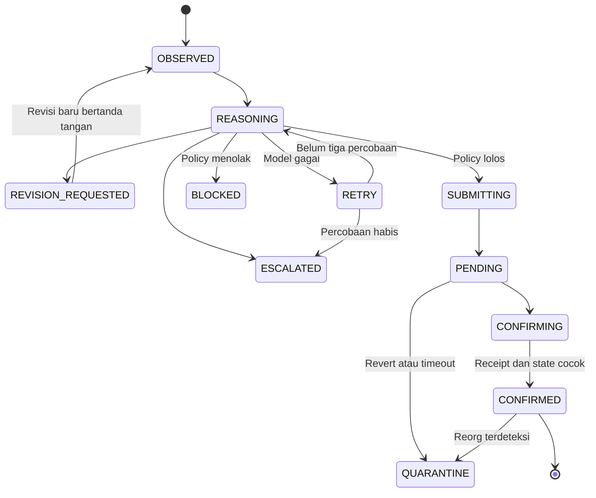

# Milestone Pilot — Riset, Pemilihan Solusi, dan Implementasi MVP

Tanggal riset: **15 September 2026**. Bahasa: Indonesia. Pembaca: pembangun solo/tim kecil dan reviewer hackathon.

## 1. Asumsi dan informasi yang belum diketahui

- Durasi kerja diasumsikan **72 jam**; belum ada nama hackathon, chain wajib, sponsor, rubric juri, deadline, komposisi tim, atau kebijakan penggunaan AI.
- Tidak mengasumsikan proyek ini memenuhi persyaratan yang belum diberikan. Bobot penilaian di bawah adalah alat seleksi internal.
- Pengguna pemula; pilih satu alur utuh dengan sedikit dependensi dan biaya layanan minimal.
- Semua nilai uang memakai aset uji. Tidak merancang trading, hasil investasi, atau penggunaan mainnet.
- Workspace kosong; tidak ditemukan repositori ataupun instruksi proyek sebelumnya. Implementasi dibuat sebagai proyek baru yang mandiri.
- Internet tersedia untuk riset dan npm, tetapi beberapa endpoint unduhan mengalami timeout. Tidak ditemukan konfigurasi RPC, owner/agent key, model Ollama, atau binary Ollama. Tidak mengakses akun/wallet pribadi untuk menebak kredensial.
- Target publik **Ethereum Sepolia**, bukan chain sponsor. Lokal menggunakan chain EVM 31337.
- Riset ini adalah desk research, **bukan wawancara pengguna**. Alur kerja dan keberadaan mekanisme didukung sumber; frekuensi kerugian, willingness-to-pay, dan manfaat AI masih perlu divalidasi.

## 2. Riset tujuh masalah beserta bukti

Penanda bukti: **operasional** = dokumentasi menjelaskan proses yang benar-benar tersedia; **klaim penyedia** = organisasi menjelaskan masalah/manfaat produknya sendiri; **institusional historis** = laporan yang mendokumentasikan pengalaman masa lalu. Tidak ada statistik atau kutipan wawancara yang dibuat-buat. Frekuensi di bawah menjelaskan kapan pekerjaan berulang, bukan prevalensi yang telah diukur.

### A. Pemeriksaan milestone hibah kecil terpisah dari pencairan dana

1. **Pengguna:** manajer hibah mikro DAO/komunitas dan kontributor penerima hibah.
2. **Situasi:** kontributor menyerahkan dokumen atau laporan, sementara pencairan menunggu evaluasi.
3. **Cara sekarang:** mencari bukti di forum/link, membaca manual, menandai selesai, lalu mengeksekusi pembayaran terpisah.
4. **Kekurangan:** pergantian konteks, interpretasi rubric tidak konsisten, riwayat alasan pembayaran sulit ditelusuri. Besarnya waktu tunggu belum diukur.
5. **Frekuensi/dampak:** setiap milestone/revisi; berpotensi menunda pembayaran atau membayar pekerjaan yang belum memenuhi mandat.
6. **Bukti:** [Karma — Why Karma](https://docs.gap.karmahq.xyz/) menjelaskan informasi kemajuan yang tersebar dan kesulitan pelacakan. Tanggal terbit tidak tercantum, diakses 15 September 2026; klaim penyedia tentang masalah yang mereka tangani. [Gitcoin — Direct Grants](https://gitcoin.co/mechanisms/direct-grants), 13 Februari 2026, menjelaskan review, pencairan bertahap, dan beban kerja penilai. Bukti mekanisme/analisis penyelenggara, bukan uji manfaat AI.
7. **AI:** membaca isi dokumen berbahasa alami terhadap kriteria; membedakan penjelasan yang lengkap, tidak lengkap, atau bertentangan; memberi alasan revisi.
8. **Blockchain:** escrow aset on-chain, mandat pembayaran yang dapat diperiksa, pelepasan dana sekali per milestone. Jika uang fiat dan semua pihak percaya satu admin, database dapat lebih sederhana.
9. **Otonomi:** meminta revisi atau mencairkan nominal tetap; memeriksa hasil lalu memproses pekerjaan berikutnya.
10. **Demo 72 jam:** kuat jika dibatasi ke evaluasi **isi dokumen kecil**, bukan pembuktian bahwa kegiatan eksternal benar-benar berlangsung.

### B. Invoice kripto perlu dicocokkan dengan pekerjaan sebelum dibayar

1. **Pengguna:** admin keuangan tim kecil yang membayar freelancer dalam aset on-chain.
2. **Situasi:** invoice tiba dalam format/uraian berbeda, dengan status tagihan dan pembayaran yang harus diselaraskan.
3. **Cara sekarang:** formulir invoice, persetujuan buyer, pemantauan status pembayaran dan rekonsiliasi manual untuk sebagian kasus.
4. **Kekurangan:** pencocokan uraian pekerjaan tetap terpisah dari perpindahan dana; deduplikasi membutuhkan identitas invoice yang konsisten.
5. **Frekuensi/dampak:** setiap invoice atau siklus berulang; risiko pembayaran tertunda atau salah pencocokan. Insiden aktual pada calon pengguna belum dikumpulkan.
6. **Bukti:** [Request Finance — Invoices](https://docs.request.finance/invoices), tanggal pasti tidak tercantum, diakses 15 September 2026. Dokumentasi mencakup approval, status pembayaran, penanganan declaredPaid dan pencegahan pembayaran ganda. Ini bukti kebutuhan alur operasional; bukan bukti bahwa platform gagal atau pelanggan membutuhkan produk baru.
7. **AI:** mengekstrak/menyamakan uraian invoice dengan kontrak kerja yang berupa teks.
8. **Blockchain:** diperlukan jika settlement adalah aset on-chain; pencocokan dan akuntansi tetap dapat off-chain.
9. **Otonomi:** bayar invoice yang cocok dengan vendor, batas nominal dan mandat; eskalasi ketidakcocokan.
10. **Demo:** layak, tetapi OCR, identitas vendor, invoice palsu dan ruang lingkup pembayaran menambah pekerjaan; diferensiasi terhadap otomasi invoice biasa lebih lemah.

### C. Kontribusi informal DAO sulit diterjemahkan menjadi kompensasi yang adil

1. **Pengguna:** koordinator kompensasi dan kontributor organisasi otonom terdesentralisasi (DAO).
2. **Situasi:** kontribusi tersebar di percakapan, pull request, mentoring dan acara; evaluasi dilakukan pada akhir periode.
3. **Cara sekarang:** voting rekan, catatan kontribusi dan alokasi reward berkala.
4. **Kekurangan:** kerja yang tidak terlihat dapat terlewat; hasil dipengaruhi jejaring sosial dan definisi nilai yang berbeda.
5. **Frekuensi/dampak:** setiap periode kompensasi; potensi perselisihan atau hilangnya motivasi. Frekuensi konflik belum diukur.
6. **Bukti:** [Coordinape — retrospektif resmi](https://coordinape.com/), tanggal terbit tidak tercantum, diakses 15 September 2026. Situs mendeskripsikan asal masalah di Yearn, mekanisme GIVE, serta mengakui blind spot dan kemungkinan permainan sistem. **Aplikasinya sudah sunset menurut situs tersebut**; ini preseden historis, bukan rekomendasi layanan aktif.
7. **AI:** menyatukan uraian kontribusi dan mendeteksi bukti yang berulang; penilaian keadilan tetap normatif.
8. **Blockchain:** distribusi anggaran DAO dan catatan alokasi; pengukuran kontribusi sendiri tidak membutuhkan blockchain.
9. **Otonomi:** menyusun dan membagikan reward dalam anggaran/recipient allowlist yang ditetapkan.
10. **Demo:** mungkin secara teknis, tetapi sulit membuktikan penilaian yang adil dalam tiga hari; pembayaran otonom memperbesar risiko bias.

### D. Hak akses komunitas tidak selalu mengikuti berakhirnya keanggotaan

1. **Pengguna:** admin komunitas berbayar/token-gated dan pengelola role DAO.
2. **Situasi:** membership berakhir, anggota keluar, atau role perlu diperbarui.
3. **Cara sekarang:** admin mengubah peran manual atau menghubungkan kontrak membership ke sistem role.
4. **Kekurangan:** perubahan lintas layanan dapat terlambat atau tidak konsisten.
5. **Frekuensi/dampak:** saat onboarding/offboarding/expiry; risiko akses yang terlalu lama atau akses sah yang hilang. Tidak ada angka kejadian tervalidasi.
6. **Bukti:** [Unlock–Hats integration](https://unlock-protocol.com/blog/unlock-protocol-and-hats-protocol-integration), **29 Oktober 2024**, mendokumentasikan assignment dan revocation otomatis berdasarkan membership. Bukti implementasi dan klaim penyedia, sekaligus menunjukkan solusi deterministik sudah ada. [Hats documentation](https://docs.hatsprotocol.xyz/), tanpa tanggal terbit, diakses 15 September 2026, menjelaskan peran yang dapat dicabut.
7. **AI:** mungkin membaca kelayakan berbasis narasi; **tidak diperlukan** untuk expiry/tanda kepemilikan token.
8. **Blockchain:** masuk akal bila membership/role asli memang on-chain; komunitas biasa dapat memakai database/SSO.
9. **Otonomi:** mencabut atau memberi role sesuai mandat, tanpa persetujuan satu per satu.
10. **Demo:** sangat mudah, tetapi digugurkan sebagai proyek AI karena aturan sederhana memadai untuk masalah yang dibuktikan.

### E. Proposal governance lolos voting, tetapi masih membutuhkan queue/execute

1. **Pengguna:** fasilitator governance dan pemegang tanggung jawab eksekusi proposal DAO.
2. **Situasi:** voting selesai dan timelock telah lewat; perubahan on-chain belum terjadi.
3. **Cara sekarang:** seseorang memanggil queue/execute melalui UI atau bot keeper.
4. **Kekurangan:** masih ada kebutuhan pemicu transaksi; proses dapat terlewat jika tidak ada operator.
5. **Frekuensi/dampak:** setiap proposal yang lolos dan perlu transaksi; kebijakan yang disetujui belum efektif. Prevalensi keterlambatan tidak ditemukan.
6. **Bukti:** [Tally/Cactus — Execute Proposals](https://docs.tally.xyz/how-to-use-tally/proposals/managing-proposals/), tanggal terbit tidak tercantum, diakses 15 September 2026, menyatakan voting selesai belum menyelesaikan proposal serta menjelaskan queue/timelock/execute. Dokumentasi operasional, bukan bukti besar dampak keterlambatan.
7. **AI:** dapat membandingkan narasi dengan calldata, tetapi pekerjaan inti menjalankan proposal yang sudah disetujui **tidak membutuhkan AI**.
8. **Blockchain:** mutlak untuk eksekusi governance on-chain; database tidak menggantikan transaksi.
9. **Otonomi:** keeper menjalankan queue/execute pada proposal/kontrak yang diizinkan.
10. **Demo:** bagus untuk otomasi, lemah untuk kebutuhan AI. Tidak dipilih meskipun blockchain dan otonominya kuat.

### F. Materi publik di IPFS tidak otomatis terjaga ketersediaannya

1. **Pengguna:** komunitas dokumentasi, penerbit informasi terbuka, pengelola arsip digital.
2. **Situasi:** node tidak aktif, data tidak dipin atau pembiayaan penyimpanan berhenti.
3. **Cara sekarang:** pin manual, beberapa salinan/node, layanan pinning, atau penyimpanan jangka panjang.
4. **Kekurangan:** pemilik harus memantau ketersediaan dan pembiayaan; memiliki content identifier tidak menjamin file tetap tersedia.
5. **Frekuensi/dampak:** ketika garbage collection, node berhenti atau layanan berakhir; materi dapat tidak bisa diakses. Angka kehilangan pada calon pengguna belum diukur.
6. **Bukti:** [IPFS — Persistence, permanence, and pinning](https://docs.ipfs.tech/concepts/persistence/), tanggal terbit tidak tercantum, diakses 15 September 2026. Dokumentasi teknis langsung menjelaskan batas persistensi. **IPFS sendiri bukan blockchain.**
7. **AI:** prioritas preservasi berdasarkan nilai isi, duplikasi dan mandat koleksi; pemeriksaan ketersediaan/repin saja cukup aturan.
8. **Blockchain:** berguna untuk anggaran/kontrak penyimpanan bersama; tidak diperlukan jika kebutuhan hanya backup.
9. **Otonomi:** memeriksa salinan, memesan perpanjangan penyimpanan dengan anggaran terbatas, memverifikasi ketersediaan.
10. **Demo:** autentikasi provider, durasi deal dan verifikasi penyimpanan menambah risiko; hash saja bukan demo preservasi yang memadai. Ditunda.

### G. Koordinasi penyaluran bantuan lintas organisasi memakai sistem yang berbeda

1. **Pengguna:** petugas operasional program bantuan yang sudah menetapkan penerima dan haknya.
2. **Situasi:** beberapa organisasi harus mencocokkan bantuan untuk penerima yang sama.
3. **Cara sekarang:** berbagi daftar, rekonsiliasi antarsistem, atau platform ledger bersama.
4. **Kekurangan:** identitas dan referensi penyaluran tidak selalu seragam; pengelolaan data sensitif dan konektivitas rumit.
5. **Frekuensi/dampak:** setiap putaran distribusi/reconciliation; risiko duplikasi atau terlewatnya bantuan. Besarnya risiko pada target baru belum diketahui.
6. **Bukti:** [UN Joint Inspection Unit, JIU/REP/2020/7](https://www.unjiu.org/sites/www.unjiu.org/files/jiu_rep_2020_7_english.pdf), **2020**, khususnya paragraf 41, 63, 74–78 dan 152–166. Laporan mendokumentasikan Building Blocks, koordinasi lintas organisasi dan batas kepercayaannya. Bukti institusional historis, tidak dipresentasikan sebagai kondisi mutakhir semua program bantuan.
7. **AI:** normalisasi laporan/pencocokan uraian; tidak diserahkan untuk menentukan kelayakan bantuan atau mengurangi hak penerima secara otomatis.
8. **Blockchain:** ledger bersama hanya jika peserta membutuhkan koordinasi tanpa satu pengendali tunggal; database bersama tetap alternatif kuat.
9. **Otonomi:** rekonsiliasi dan eksekusi hak yang sudah diotorisasi, eskalasi identitas yang tidak jelas.
10. **Demo:** hanya sintetis; sulit memvalidasi identitas, privasi dan kebutuhan operasional dalam 72 jam. Tidak dipilih.

### Validasi pengguna yang belum dilakukan

Wawancarai dua pengelola hibah dan tiga kontributor; minta contoh tiga milestone terakhir, waktu review/payout, alasan revisi, dan jenis mandat yang mau didelegasikan. Jangan bertanya hanya “apakah AI berguna”. Catat waktu aktual, bukti kerja yang boleh dianonimkan, dan kegagalan proses. Uji 20 dokumen dengan label dua reviewer; bandingkan model dengan baseline daftar periksa/keyword. Bila kriteria selalu berupa boolean terstruktur atau pengguna tidak mau mendelegasikan payout sekecil apa pun, revisi konsep, jangan memaksakan AI/otonomi.

## 3. Tabel penilaian dan solusi terpilih

Skor 1–5 adalah **penilaian desain sementara**, bukan statistik riset dan bukan rubric resmi juri.

| Kandidat | Masalah 20% | AI 15% | Blockchain 15% | Otonomi 15% | MVP 20% | Demo 15% | Total /100 |
|---|---:|---:|---:|---:|---:|---:|---:|
| A. Milestone hibah | 5 | 4 | 4 | 5 | 4 | 5 | **90** |
| B. Invoice kripto | 4 | 3 | 4 | 5 | 4 | 3 | 77 |
| C. Kompensasi DAO | 4 | 4 | 3 | 3 | 3 | 3 | 67 |
| D. Akses membership | 3 | 1 | 4 | 5 | 5 | 2 | 68 |
| E. Eksekusi governance | 4 | 1 | 5 | 5 | 4 | 2 | 71 |
| F. Preservasi IPFS | 4 | 3 | 2 | 4 | 2 | 4 | 63 |
| G. Koordinasi bantuan | 5 | 3 | 3 | 3 | 1 | 3 | 60 |

Rumus: `Σ(skor/5 × bobot)`. Contoh A: `20 + 12 + 12 + 15 + 16 + 15 = 90`.

| Kandidat | Tanpa AI | Tanpa blockchain | Tanpa otonomi |
|---|---|---|---|
| A | Aturan cukup untuk “file ada”; tidak cukup untuk kesesuaian isi naratif. Pertahankan AI hanya untuk isi dokumen. | DB dapat merekam review, tetapi tidak menegakkan escrow aset on-chain. | Mandat awal mengunci pembayaran; release tidak meminta approval baru. |
| B | Invoice terstruktur cukup aturan; AI hanya untuk format/uraian heterogen. | Akuntansi bisa DB; transfer aset on-chain tetap transaksi. | Vendor dan invoice range diotorisasi awal. |
| C | Rekap voting bisa deterministik; AI merangkum kontribusi, tidak membuktikan keadilan. | Penilaian kontribusi tidak perlu chain; payout treasury perlu. | Delegasi penuh menyisakan risiko bias yang besar. |
| D | Expiry dan role lookup cukup aturan; **gugur untuk AI**. | Jika membership bukan on-chain, gunakan SSO/DB. | Pencabutan otomatis sudah dapat dilakukan kontrak/modul. |
| E | Queue/execute cukup keeper; **gugur untuk AI pada inti masalah**. | Chain wajib karena state governance berubah di sana. | Proposal lolos adalah mandat; caller tidak perlu approval baru. |
| F | Liveness/repin cukup aturan; AI hanya prioritas kuratorial. | Backup biasa tidak butuh chain; jangan menambahkan ledger kosmetik. | Provider/anggaran dapat didelegasikan, tetapi integrasi berat. |
| G | Pencocokan ID exact cukup aturan; AI hanya menangani dokumen heterogen. | DB bersama sering memadai; keperluan multi-pihak harus dibuktikan. | Hak bantuan ditetapkan manusia; agent hanya menjalankan mandat operasional. |

**Pilihan: A, Milestone Pilot.** Keunggulannya adalah loop keputusan dan pembayaran yang terlihat, ruang lingkup kecil, serta kontrak dengan mandat sederhana. Invoice lebih padat pesaing dan integrasi data; kompensasi DAO sulit dinilai adil; membership/governance gagal uji kebutuhan AI; preservasi memerlukan provider; bantuan terlalu berat untuk validasi yang layak.

Trade-off utama: mengurangi cakupan ke **dokumen sebagai deliverable itu sendiri**. Jangan menganggap laporan “kami mengadakan workshop” membuktikan workshop terjadi. Kelemahan terbesar adalah oracle problem: kontrak masih mempercayai penilaian off-chain. Jika model salah, payout yang salah tetap bisa terjadi **di dalam mandat**.

Sensitivitas: bila kebutuhan AI pada A ternyata hanya mendapat skor 2, total menjadi 84. Bila kecocokan blockchain juga turun ke 2 karena semua pengguna memilih pembayaran bank, total menjadi 78 dan alasan membangun Web3 perlu ditinjau ulang. Skor tinggi tidak menggantikan validasi.

## 4. Konsep produk dan ruang lingkup MVP

**Nama:** Milestone Pilot. **Tagline:** “Bukti kerja menjadi pembayaran, dalam batas mandat.”

**Masalah satu kalimat:** Pengelola hibah mikro harus berulang kali menilai dokumen milestone dan melakukan pembayaran terpisah, sehingga kontributor menunggu dan alasan pencairan sulit ditelusuri.

**Persona:** pengelola komunitas yang mendanai beberapa dokumen edukasi kecil; sudah memiliki treasury testnet/DAO, rubric yang jelas, dan penerima yang dikenal. Bukan lembaga yang belum membutuhkan blockchain.

**Skenario bernilai:** komunitas mendanai panduan katalog perpustakaan. Kontributor menyerahkan versi yang baru menjelaskan pencarian. Agent meminta penjelasan lokasi rak/ketersediaan. Setelah revisi melengkapi isinya, agent melepaskan 0,001 ETH uji dan memverifikasi pembayaran tanpa approval tambahan dari pengelola.

**Manfaat yang ditargetkan:** mengurangi pemindahan pekerjaan dari review ke pembayaran; menjelaskan kekurangan dokumen; mempertahankan batas finansial yang jelas. Penghematan waktu aktual belum diukur.

**Sebelum:** kirim dokumen → tunggu admin → revisi lewat chat → tunggu cek ulang → buka wallet → transfer → update spreadsheet.

**Sesudah:** pemilik mendaftarkan rubric/penerima/nominal → bukti bertanda tangan masuk → agent menilai → meminta revisi atau melakukan release → memeriksa receipt/event/state → lanjut memantau.

| Pendekatan pembanding | Fungsi yang relevan | Posisi Milestone Pilot |
|---|---|---|
| Karma GAP | Pelaporan kemajuan/attestation dan keterlacakan hibah | Menambahkan penilaian isi dokumen dan release terbatas; **belum terintegrasi** Karma. |
| Request Finance | Invoice, approval dan tracking pembayaran | Fokus deliverable dokumen terhadap rubric, bukan sistem akuntansi. |
| Kontrak escrow + admin manual | Menahan dan mencairkan dana | Mengotomatiskan keputusan dalam mandat sempit; menambah risiko kesalahan model. |
| Script checklist | Sangat baik untuk aturan objektif/terstruktur | Baseline yang wajib dibandingkan; AI hanya bernilai bila mengatasi variasi semantik. |

**Tiga fitur inti:** (1) mandat escrow dan pencabutan izin; (2) evaluasi bukti, revisi dan tindakan agent; (3) jejak keputusan serta verifikasi pembayaran.

**Ditunda:** integrasi GitHub/Karma, OCR/PDF, banyak chain, token sendiri, voting reviewer, arbitrase, reputasi, notifications eksternal, ERC-4337/session wallet, hosting publik dan multiuser.

**Metrik target, bukan hasil yang diklaim:** satu pembayaran per milestone; nol transaksi melewati batas kontrak pada skenario uji; nol pekerjaan berikutnya sebelum verifikasi; maksimal tiga percobaan model; evaluasi 20 dokumen berlabel manusia dengan precision release ≥95% sebelum memperluas eksperimen; latency keputusan dan pencairan dilaporkan terpisah. Precision pada dataset kecil tidak membuktikan keamanan umum.

| Peran manusia | Peran AI Agent | Peran smart contract |
|---|---|---|
| Pemilik menentukan rubric, penerima, nominal, batas dan tenggat; mendanai dan boleh mencabut mandat. | Memeriksa dokumen, meminta revisi, memilih release/escalate dan memverifikasi hasil melalui kode. | Memvalidasi otoritas, masa berlaku, plafon, penerima tetap dan pembayaran sekali. |
| Penerima membuat dokumen, menandatangani bukti dan mengirim revisi. | Menyimpan status/riwayat dan berhenti ketika tidak dapat memastikan hasil. | Memindahkan ETH uji dan mengeluarkan event hash bukti/keputusan. |
| Operator menangani kejadian luar biasa dan sengketa. | Tidak mengubah hak pembayaran atau membuat penerima baru. | Tidak membuktikan kualitas karya atau kejujuran penulis. |

## 5. Arsitektur, alur agent, dan batas keamanan

### Stack dan lokasi

| Komponen | Pilihan | Lokasi/alasan |
|---|---|---|
| Blockchain | Ethereum Sepolia; Ganache EVM untuk lokal | Sepolia untuk kontrak aplikasi; lokal cepat dan tanpa faucet. Tidak ada syarat sponsor. |
| Kontrak | Solidity 0.8.30, target Shanghai | On-chain; satu escrow sederhana, tanpa proxy upgrade. |
| Framework agent | State machine JavaScript sendiri | Off-chain; alur sempit tidak membutuhkan framework besar. |
| Model | Ollama Chat API, default configurable Qwen3 4B | Off-chain; API tanpa biaya per request bila lokal, tetapi memakai RAM/CPU. Belum dijalankan pada lingkungan ini. |
| Backend | Node.js 24, native HTTP | Off-chain; satu worker polling 1,5 detik. |
| Signer | Child process + ethers 6.17.0 | Off-chain; key tidak ada dalam prompt, tool model atau log. |
| Frontend | HTML/CSS/JS dan ethers browser | Browser; wallet digunakan untuk mandat/bukti pada testnet. |
| Penyimpanan | SQLite native Node | Off-chain; status dan signed-transaction journal terpisah. |
| Validasi | Ajv JSON Schema | Off-chain deterministik, lalu batas kontrak on-chain. |

Ganache telah diarsipkan upstream dan digunakan hanya sebagai harness lokal; migrasi ke Anvil/Hardhat yang dipelihara layak untuk proyek setelah hackathon. Tidak mengklaim dependensi ini pilihan baru terbaik untuk produksi.



### Sepuluh komponen loop agent

| Komponen | Implementasi konkret |
|---|---|
| Trigger | Worker polling setiap 1,5 detik; bukti baru masuk melalui API. Scheduler bukan transaksi otomatis dari kontrak. |
| Observation | Baca milestone/paid/pause/revoke/deadline dari RPC; ambil rubric dan dokumen bertanda tangan dari SQLite. |
| Reasoning | LLM membandingkan makna isi dokumen dengan rubric: release, minta revisi atau eskalasi. |
| Tools | `observe`, `model.decide`, `signer.execute`, `signer.inspect`; LLM sendiri tidak memiliki general-purpose tools. |
| Policy | Rubric hash harus cocok, signature milik penerima, schema ketat, seluruh criteria met dan quote ditemukan; kontrak mengunci dana. |
| Execution | Signer membentuk sendiri `release(milestoneId,evidenceHash,decisionHash)` dengan value transaksi nol. Dana keluar dari escrow. |
| Verification | Receipt status 1, block hash kanonik pada saat cek, kedalaman konfirmasi, event cocok id/recipient/amount/hash dan paid=true. |
| Recovery | Model maksimal tiga percobaan. Broadcast tidak pasti direkonsiliasi memakai hash dan byte transaksi yang sama; pending tidak dilompati. |
| Memory | Bukti per revisi, rubric, keputusan, event status, hash/nonce melalui raw signed transaction di journal, anggaran gas yang sudah direservasi. |
| Stop | Escalate dokumen mencurigakan, retry habis, mandat tidak aktif, atau karantina saat pending timeout/revert/reorg/verifikasi gagal. |

### Contoh lengkap

Mandat: `catalog-guide`, penerima yang sudah terdaftar, pembayaran tetap **0,001 ETH uji**, anggaran escrow **0,003 ETH uji**, dua kriteria. Identitas milestone adalah `keccak256` label melalui ethers `id()`.

Input revisi 1 hanya menjelaskan pencarian judul/pengarang. Keputusan fixture pengujian: `REQUEST_REVISION`, karena perbedaan lokasi rak dan status ketersediaan belum dijelaskan. Tidak ada transaksi release.

Input revisi 2:

> Panduan katalog perpustakaan: ketik judul buku atau nama pengarang pada kotak pencarian, lalu tekan Cari. Lokasi rak menunjukkan tempat buku disusun; status ketersediaan menunjukkan apakah eksemplar tersedia atau sedang dipinjam. Jika tersedia, catat nomor panggil sebelum menuju rak.

Keputusan terstruktur untuk contoh ini (fixture dalam pengujian; hasil LLM nyata dapat berbeda):

```json
{
  "action": "RELEASE",
  "reason": "Kedua kriteria tercakup dalam dokumen. Ini hanya penilaian konten panduan, bukan bukti dampak penggunaan.",
  "checks": [
    {
      "criterion": "Menjelaskan pencarian katalog berdasarkan judul atau pengarang.",
      "met": true,
      "quote": "ketik judul buku atau nama pengarang pada kotak pencarian"
    },
    {
      "criterion": "Menjelaskan perbedaan lokasi rak dan status ketersediaan.",
      "met": true,
      "quote": "Lokasi rak menunjukkan tempat buku disusun; status ketersediaan menunjukkan apakah eksemplar tersedia atau sedang dipinjam."
    }
  ]
}
```

Validator memeriksa properti tambahan tidak ada, checks sama urutan dengan rubric, quote benar-benar terdapat pada dokumen, signature sah, dan rubric hash cocok. Signer memeriksa chain, operator, milestone, masa berlaku dan gas; kemudian menandatangani transaksi dan **mencatat hash sebelum broadcast**. Kontrak memeriksa batasnya lagi. Setelah release, verifier memeriksa receipt/event/state; saldo penerima bertambah pada tes. Hash/alamat aktual disimpan di `evidence/local-transactions.json`, jelas ditandai chain lokal.

**Probabilistik:** interpretasi isi dan penilaian dukungan kutipan oleh LLM. **Deterministik:** signature, hash, JSON Schema, urutan kriteria, quote substring, nominal, gas, akses fungsi, nonce, idempotensi dan verifikasi receipt. Jangan mencampur kedua jenis jaminan ini.

### State machine



`QUARANTINE` dalam diagram adalah kelompok status implementasi: `REVERTED`, `PENDING_TIMEOUT`, `REORG_DETECTED`, `VERIFICATION_FAILED`. `RPC_ERROR` menunggu rekonsiliasi. Di chain lokal instamine, proses bisa langsung `SUBMITTING → CONFIRMED`.

### Batas keamanan dan kepercayaan

- **LLM tidak mengakses key.** Hanya rubric dan teks dikirim melalui API. Signer berada di proses lain dan menerima request sempit, bukan output LLM mentah.
- **Mandat on-chain:** hanya operator yang boleh release; pemilik yang mendaftarkan milestone. Penerima, nominal dan rubric hash tidak dapat ditimpa. Alokasi total ≤ budget, deadline wajib, paid satu kali.
- **Signer:** alamat kontrak tetap, fungsi release tetap, value transaksi 0; chain hanya lokal/Sepolia; gas limit ≤180.000, gas price ≤20 gwei, reservasi total ≤0,01 ETH uji per journal mandat.
- **Pencabutan:** owner dapat pause, revoke permanen, lalu refund sisa. Revoke tidak membatalkan transaksi yang sudah lebih dahulu masuk block; kontrak menegakkan urutan on-chain.
- **Input tak tepercaya:** tidak ada URL fetch bebas, shell, eksekusi isi dokumen, atau prompt dengan secret. Tripwire hanyalah tambahan; penipuan semantik tetap mungkin.
- **Idempotensi:** unique key milestone+revisi, status paid on-chain, journal sebelum broadcast, retry transaksi identik. Single signer/worker; bukan sistem concurrency multi-server.
- **RPC dan reorg:** cek receipt lama sebelum pekerjaan berikutnya. Jika receipt hilang setelah confirmed, hentikan tanpa mengirim ulang otomatis. Dua konfirmasi testnet tidak sama dengan finalitas.
- **Batas kriptografi:** signature membuktikan asal bukti; hash membuktikan komitmen integritas; keduanya tidak membuktikan kualitas karya. EOA operator ini bukan session-key wallet yang secara kriptografis melarang transaksi ke semua alamat lain.
- **Trusted backend:** kompromi host/signer dapat meloloskan penilaian palsu untuk semua milestone yang sudah diotorisasi, tetapi kontrak tetap tidak mengizinkan penerima baru/nominal baru. Saldo gas EOA tidak dilindungi oleh kontrak escrow.
- **Kepercayaan owner:** owner dapat mencabut dan menarik sisa dana; belum ada arbitrase atau jendela keberatan. Penerima menerima klausul itu saat mengikuti eksperimen.

Struktur folder, seluruh antarmuka API dan perintah setup ada di README. Rujukan implementasi yang diperiksa: [ethers v6](https://docs.ethers.org/v6/getting-started/), [Solidity security](https://docs.soliditylang.org/en/latest/security-considerations.html), [Ollama chat](https://docs.ollama.com/api/chat), [structured output](https://docs.ollama.com/capabilities/structured-outputs), diakses 15 September 2026.

## 6. Implementasi

Satu alur vertikal dibangun: kontrak escrow → schema & signature → worker → signer → receipt verifier → API/UI → skenario demo dan pengujian. Kode fungsi inti dapat dijalankan, bukan pseudocode. Kode tidak bergantung pada account sponsor.

| Urutan | Pekerjaan yang tersedia |
|---|---|
| 1 | Pemeriksaan workspace: proyek baru tanpa repo/instruksi lama. |
| 2 | Rencana berdasarkan dependensi, pemilihan satu masalah dan pembatasan dokumen. |
| 3 | Package lock, scripts, direktori, `.env.example`, `.gitignore`. |
| 4 | Kontrak minimal dengan release/register/pause/revoke/refund. |
| 5 | Agent berstatus persisten, output AI tervalidasi dan bukti bertanda tangan. |
| 6 | Proses signer terpisah, transaksi nyata pada EVM, batas gas dan verifikasi. |
| 7 | UI pemberian mandat, dokumen, jejak keputusan, hash transaksi dan kontrol izin. |
| 8 | Dua dokumen sintetis yang dapat diulang; mode fixture dinyatakan di UI. |
| 9 | Tes alur utama dan batas kewenangan serta skenario kegagalan. |
| 10 | Demo lokal; script deployment Sepolia dan jalur wallet tersedia, belum deploy publik. |
| 11 | README, riset, pitch, demo, FAQ juri dan bukti tes. |

Perintah utama:

```bash
npm ci
npm run compile
npm test
npm run demo
```

Rencana bila dikerjakan dalam lomba 72 jam: jam 0–8 validasi masalah dan aturan lomba; 8–22 kontrak dan mandat; 22–38 agent/signer; 38–50 UI dan jalur lengkap; 50–62 uji model adversarial dan testnet; 62–72 rekam demo, perbaiki blocker dan submission. Ini rencana pembagian waktu, bukan klaim bahwa pekerjaan di sesi ini memakan 72 jam.

## 7. Hasil pengujian dan status deployment

**Hasil akhir: 20/20 tes inti lulus**, tidak ada tes gagal atau dilewati; durasi run tercatat sekitar 21,7 detik. Bukti: `evidence/tests.tap` dan `evidence/local-transactions.json`.

**Uji browser juga lulus:** alur mandat → revisi → release → penolakan signer berjalan melalui UI dan proses signer terpisah. Total tercairkan 0,001 ETH uji; tidak ada JavaScript page error; viewport 1400×1100 dan 390×844 diperiksa, tanpa overflow horizontal pada mobile. POST tanpa token sesi mendapat HTTP 403. Screenshot desktop/mobile telah dilihat untuk pemeriksaan tata letak. Bukti: `evidence/browser-check.json`, `evidence/demo-desktop.png` dan `evidence/demo-mobile.png`.

Jangan menganggap file hash lokal sebagai transaksi Sepolia. Ringkasan verifikasi: `evidence/VERIFIKASI.md`.

| Syarat pembuktian | Cara pembuktian |
|---|---|
| Baca kondisi dan pilih tindakan | Dokumen sintetis belum lengkap → revision; dokumen lengkap → release melalui fixture berlabel. **Belum mengukur kualitas LLM**. |
| State on-chain berubah | Kompilasi/deploy ke Ganache; paid=true, spent naik, saldo penerima bertambah; receipt/event diperiksa. |
| Di luar mandat ditolak | Unknown milestone, operator salah, penerima/nominal tambahan di schema, batas per-milestone dan total budget. |
| Input berbahaya tidak memperluas mandat | Prompt injection contoh dieskalasi; model double yang menambah recipient/amount ditolak; akses kontrak tetap dibatasi. Bukan bukti kebal semua injection. |
| Tidak ada eksekusi ganda | Trigger berulang, tick paralel pada satu instance, replay kontrak, dan journal setelah restart. |
| Kegagalan transaksi jelas | Transaksi revert yang benar-benar ditambang pada chain lokal; RPC outage diinjeksikan, pending dan timeout dengan mining dihentikan. |
| Verifikasi sebelum lanjut | Milestone kedua menunggu transaksi pertama; kedalaman konfirmasi dan reorg snapshot diuji. |

**Mock/fixture yang dipakai:** respons keputusan dua dokumen, server HTTP pengganti Ollama dalam tes adapter, input laporan sintetis dan gangguan RPC yang diinjeksi. **Bukan mock:** compiler Solidity, EVM lokal, eksekusi kontrak, tanda tangan, perpindahan ETH uji lokal, receipt/event/state dan database.

**Deployment publik:** belum dilakukan. Konfigurasi RPC Sepolia, dua key testnet, saldo gas/escrow, serta model nyata yang tersedia belum disediakan. Tidak ada alamat kontrak testnet atau transaction hash publik yang dikarang. Script deployment dan jalur UI wallet disiapkan untuk menutup gap tersebut.

## 8. Materi submission dan demo

Pitch 60 detik, naskah demo 3 menit, ringkasan submission dan lima pertanyaan juri tersedia lengkap di `SUBMISSION.md`. Naskah membedakan demo lokal fixture yang sudah dapat dijalankan dengan target demo Sepolia+LLM yang baru boleh diklaim setelah diverifikasi.

Pesan utama: **agent boleh mengambil keputusan, tetapi batas pembayaran ditentukan oleh mandat yang dapat diperiksa**. Diferensiasi adalah hubungan antara keputusan dokumen, batas eksekusi, dan pemeriksaan hasil; bukan klaim model paling pintar atau semua komponen terdesentralisasi.

## 9. Pekerjaan tersisa yang benar-benar diperlukan

1. **Konfirmasi aturan hackathon**: chain/SDK sponsor, syarat repo terbuka, format submission dan kebijakan AI. Port ke chain lain hanya jika diwajibkan dan diuji ulang.
2. **Jalankan model nyata**: aktifkan Ollama, ukur latency, uji 20 dokumen termasuk kontradiksi, negasi, instruksi tersembunyi dan kutipan yang tidak mendukung kriteria. Bandingkan baseline aturan dan penilaian manusia.
3. **Validasi pengguna**: wawancara lima calon pengguna; ukur waktu review/payout, kebutuhan escrow dan penerimaan mandat terbatas. Hentikan klaim manfaat jika tidak didukung hasil.
4. **Tutup alur testnet**: isi konfigurasi lokal, faucet, deploy, registrasi mandat via owner wallet, tanda tangan bukti via recipient, dan rekam transaksi agent di explorer. Jalankan minimal satu uji batas izin pada deployment tersebut.
5. **Rekam demo jujur**: tampilkan mode model, chain, bukti revisi, receipt, hash, pembayaran sekali dan penolakan di luar izin. Jangan menyebut mode fixture sebagai AI nyata atau chain lokal sebagai Sepolia.

Audit profesional, multi-host reliability, arbitrase dan hosting publik diperlukan untuk perluasan penggunaan, tetapi bukan alasan menambah fitur sebelum kelima langkah di atas selesai.
