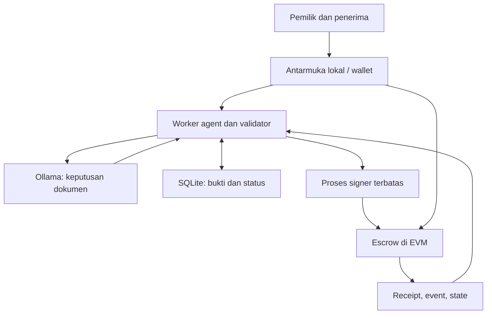

# Milestone Pilot

**Bukti kerja menjadi pembayaran, dalam batas mandat.**

MVP hackathon AI Agent Web3 untuk menilai **isi dokumen milestone kecil** dan melepaskan escrow (dana yang dititipkan di kontrak) kepada penerima yang telah ditetapkan. Agent mengamati bukti, meminta revisi atau memutuskan pelepasan dana, mengirim transaksi, lalu memeriksa receipt, event, dan state kontrak sebelum melanjutkan.

**Status:** prototipe testnet. **20/20 tes inti lulus**, dan alur UI desktop/mobile berhasil diuji dengan browser. Mode lokal menggunakan EVM nyata dengan respons model fixture yang ditandai **bukan LLM**. Adapter Ollama diimplementasikan; inferensi model nyata dan deployment Sepolia belum dijalankan dalam lingkungan pembuatan ini. Tidak ada klaim keamanan produksi atau akurasi penilaian model.

## Masalah dan solusi

Manajer hibah perlu membaca laporan yang tersebar, menilai pencapaian, kemudian mengatur pembayaran. [Karma mendokumentasikan masalah pelacakan kemajuan](https://docs.gap.karmahq.xyz/); [Gitcoin menjelaskan beban review dan pencairan milestone](https://gitcoin.co/mechanisms/direct-grants) (13 Februari 2026). Sumber tersebut menunjukkan alur dan masalah, bukan ukuran pasar atau bukti bahwa AI ini sudah efektif.

MVP dibatasi pada dokumen yang dapat dinilai dari isinya, misalnya panduan katalog perpustakaan. Bukan untuk membuktikan acara benar-benar berlangsung, perangkat lunak bebas bug, atau klaim dampak sosial. Dana dan penerima dikunci terlebih dahulu; LLM hanya memilih `RELEASE`, `REQUEST_REVISION`, atau `ESCALATE`.

## Jalankan demo lokal

Prasyarat: Node.js **24+**, npm. Tidak perlu wallet, faucet, API berbayar, Docker, atau model untuk mode pengujian.

```bash
npm ci
npm run compile
npm test
npm run demo
```

Buka **http://127.0.0.1:4173** pada komputer tempat aplikasi dijalankan.

1. Klik **Buat mandat dan danai escrow lokal**. Default anggaran 0,003 ETH uji, masing-masing milestone 0,001 ETH uji, masa berlaku satu jam. Dua milestone didaftarkan ke penerima lokal.
2. Pilih `catalog-guide`, klik **Bukti belum lengkap**, kirim revisi 1. Tunggu `REVISION_REQUESTED`.
3. Klik **Bukti lengkap**, kirim revisi 2. Tanpa klik persetujuan pembayaran, agent menghasilkan `CONFIRMED` dan total tercairkan bertambah 0,001 ETH uji.
4. Kirim revisi 2 yang sama lagi. Pembayaran tidak bertambah.
5. Klik **Uji batas penerima**. Permintaan menambah alamat ke antarmuka signer ditolak. Ini penolakan sebelum transaksi; bukan transaksi revert di explorer.
6. Pilih `policy-test`, masukkan **Input berbahaya**, kirim revisi 3. Agent melakukan eskalasi. Tombol Jeda/Lanjutkan/Cabut izin membuat transaksi pemilik kontrak lokal.

Mode fixture hanya mengenali dua dokumen sintetis secara persis. Teks lain dieskalasi, tidak diam-diam dinilai memakai aturan yang disebut AI. Untuk mengulang demo, hentikan dengan Ctrl+C lalu jalankan lagi; chain dan kunci lokal baru dibuat. Riwayat run lama tetap di `runtime/`, tetapi chain lokalnya sudah tidak hidup.

## Jalankan LLM nyata melalui Ollama

Pasang Ollama menurut [petunjuk resmi](https://docs.ollama.com/quickstart), lalu jalankan server dan unduh model yang mendukung keluaran terstruktur. Default yang dikonfigurasi adalah `qwen3:4b`; Anda dapat menggantinya. Model dan performa pada perangkat Anda belum diuji.

```bash
ollama pull qwen3:4b
cp .env.example .env
```

Pastikan `.env` berisi:

```dotenv
MODEL_MODE=ollama
OLLAMA_URL=http://127.0.0.1:11434
OLLAMA_MODEL=qwen3:4b
```

```bash
npm run demo:llm
```

`ollama serve` diperlukan jika layanan Ollama belum berjalan. Port model hanya digunakan backend. Tidak ada fallback tersembunyi ke fixture saat model gagal. Status menjadi `RETRY`, maksimal tiga percobaan dengan jeda meningkat, lalu `ESCALATED`. Laptop RAM 8 GB sebaiknya menutup aplikasi berat; latensi dan kecukupan RAM perlu diukur langsung. Parameter API diperiksa terhadap [Chat API](https://docs.ollama.com/api/chat) dan [Structured Outputs](https://docs.ollama.com/capabilities/structured-outputs), diakses 15 September 2026.

## Deploy Ethereum Sepolia

Sepolia dipilih untuk kompatibilitas EVM dan penggunaan pengujian aplikasi, bukan kewajiban sponsor. [Dokumentasi jaringan Ethereum](https://ethereum.org/developers/docs/networks/) menyarankan Sepolia untuk pengembangan aplikasi; diakses 15 September 2026.

1. Siapkan **dua wallet testnet baru**: owner dan agent. Owner memerlukan 0,003 ETH uji untuk escrow ditambah gas deployment/registrasi. Agent memerlukan ETH uji untuk gas. Penerima boleh wallet testnet ketiga. Dapatkan dari faucet yang tercantum pada dokumentasi jaringan.
2. Isi `RPC_URL`, `OWNER_PRIVATE_KEY`, dan `AGENT_ADDRESS` secara lokal di `.env`. Jangan kirim private key melalui chat atau commit ke git.
3. Jalankan `npm run deploy:sepolia`. Skrip menolak chain selain `11155111`; escrow dibuat dengan batas per milestone 0,001 ETH uji dan masa berlaku 24 jam. Alamat/hash hanya dicetak setelah deployment selesai.
4. Salin alamat yang dihasilkan ke `CONTRACT_ADDRESS`. Hapus `OWNER_PRIVATE_KEY` dari `.env`, lalu isi `AGENT_PRIVATE_KEY` untuk wallet agent yang sesuai.
5. Pastikan Ollama berjalan, kemudian `npm start`. Mode Sepolia selalu menggunakan adapter model nyata; fixture tidak tersedia.
6. Di UI, hubungkan wallet **owner** pada Sepolia. Isi penerima dan dua kriteria, lalu daftarkan milestone. Registrasi adalah mandat awal, bukan persetujuan setiap pembayaran. Tombol **Muat kriteria milestone yang sudah terdaftar** memulihkan metadata setelah backend baru dimulai, dengan mencocokkan hash rubric.
7. Ganti akun wallet ke **penerima**, klik Hubungkan wallet lagi, lalu kirim bukti. Wallet hanya menandatangani teks bukti, tidak transaksi pembayaran.
8. Tunggu transaksi agent dan dua konfirmasi. Buka tautan Etherscan di aktivitas. Dua konfirmasi merupakan kebijakan demo, **bukan finalitas ekonomi**.

Backend hanya mendengarkan loopback. Menjalankannya pada komputer lain memerlukan deployment dan autentikasi yang belum menjadi bagian MVP. Jangan mengekspos port langsung ke internet. Jangan menjalankan dua backend/signer dengan key dan database yang sama.

## Arsitektur



Kontrak Solidity on-chain: owner, operator, masa berlaku, anggaran, penerima, nominal, komitmen rubric, status paid, hash bukti dan keputusan melalui event. Semua penilaian bahasa, scheduler, UI, signer, RPC client, dan SQLite **off-chain**. Ini arsitektur hibrida dengan backend yang dipercaya; tidak sepenuhnya terdesentralisasi.

Tidak memakai framework agent besar: state machine kecil lebih mudah ditelusuri untuk satu alur. ethers 6.17.0 menangani ABI, tanda tangan dan RPC; Ajv 8.17.1 memvalidasi JSON. solc 0.8.30 mengompilasi kontrak dengan target Shanghai. Ganache 7.9.2 hanya mesin EVM untuk pengujian lokal; proyek upstream sudah diarsipkan. Node 24 dapat menampilkan peringatan µWS lalu memakai implementasi Node. Peringatan tersebut bukan kegagalan transaksi. [Dokumentasi ethers](https://docs.ethers.org/v6/getting-started/) dan [status Ganache](https://github.com/ConsenSys-archive/ganache), diakses 15 September 2026.

## Struktur kode

| Lokasi | Isi |
|---|---|
| `contracts/MilestoneEscrow.sol` | Escrow, mandat, payout, pause/revoke/refund |
| `src/agent.mjs` | Observe → decide → execute → verify; scheduler dipanggil server |
| `src/model.mjs` | Adapter Ollama dan fixture yang eksplisit |
| `src/schema.mjs` | Schema keputusan, bukti bertanda tangan, hash rubric |
| `src/signer.mjs` | Proses penandatangan, gas budget, journal transaksi, verifikasi |
| `src/signer-client.mjs` | IPC (komunikasi antaraproses) dengan signer |
| `src/store.mjs` | SQLite persisten dengan unique key |
| `src/server.mjs` | API loopback dan bootstrap demo |
| `public/` | UI responsif tanpa framework |
| `scripts/` | Compile dan deploy Sepolia |
| `test/` | Tes perilaku agent, kontrak dan failure recovery |
| `docs/` | Riset, keputusan desain, pitch dan submission |
| `evidence/` | Hasil pengujian dan hash transaksi lokal yang benar-benar dihasilkan |
| `.env.example` | Konfigurasi tanpa secret |

## API dan tools agent

POST menggunakan header `x-session-token` dari `GET /api/session`. Host/Origin dibatasi loopback. Ini perlindungan aplikasi lokal, bukan sistem login multiuser.

| Endpoint/tool | Fungsi dan batas |
|---|---|
| `GET /api/state` | Status mandat, bukti, keputusan, hash transaksi |
| `GET /api/artifact` | ABI/bytecode yang dikompilasi |
| `POST /api/mandate` | Bootstrap mandat, hanya demo lokal |
| `POST /api/rubric` | `{milestoneId,label,rubric}`; hanya diterima jika hash cocok dengan kontrak |
| `POST /api/evidence` | `{milestoneId,revision,text,signature}`; signer bukti harus penerima |
| `POST /api/demo/evidence` | Menandatangani bukti dengan wallet sintetis; hanya lokal |
| `POST /api/demo/control` | `{action:pause|resume|revoke}`; owner lokal |
| `POST /api/demo/attack` | Uji request di luar schema signer, hanya lokal |
| `Agent.observe` | Baca mandat, validasi bukti, antrekan berdasarkan milestone/revisi |
| `model.decide` | Rubric tepercaya + dokumen tidak tepercaya → JSON, tanpa akses tools |
| `signer.execute` | Hanya `{milestoneId,evidenceHash,decisionHash}`; satu alamat kontrak, fungsi release, value=0 |
| `signer.inspect` | Cocokkan receipt sukses, block hash, event dan state paid |

## Output AI

```json
{
  "action": "RELEASE",
  "reason": "Kedua kriteria terlihat pada isi dokumen.",
  "checks": [
    {"criterion": "Kriteria yang sama persis dengan mandat", "met": true, "quote": "Kutipan persis dari dokumen bukti"}
  ]
}
```

Jumlah dan urutan checks harus sama dengan rubric. Tidak boleh ada properti tambahan. Setiap `met=true` membutuhkan kutipan minimal delapan karakter yang ditemukan persis di dokumen. `RELEASE` mensyaratkan seluruh checks terpenuhi. Kutipan yang cocok **tidak membuktikan entailment** (bahwa kutipan benar-benar mendukung kesimpulan); hal tersebut masih memerlukan evaluasi model.

## Keamanan dan batas kepercayaan

| Batas | Implementasi / keterbatasan |
|---|---|
| Otoritas LLM | Model menerima teks/rubric saja, tanpa private key atau tools transaksi. Output tidak bisa berisi penerima, nominal atau arbitrary calldata. |
| Signer | Child process berbeda, IPC privat; satu fungsi pada satu kontrak, dua chain yang diizinkan, transaksi value=0. Ini pemisahan proses, bukan enclave atau isolasi terhadap kompromi host. |
| Delegasi | `operator` kontrak adalah mandat terbatas yang bisa dicabut. Bukan session key ERC-4337. Key EOA yang dicuri masih dapat membelanjakan saldo gas miliknya. |
| Escrow | Per milestone, penerima/rubric/nominal tidak dapat diubah. Total alokasi ≤ budget; paid mencegah pembayaran kedua. |
| Gas | Gas limit maksimum 180.000; gas price maksimum 20 gwei; total reservasi gas sepanjang mandat maksimum 0,01 ETH uji di journal signer. Reservasi konservatif tidak dilepas kembali. |
| Bukti | Tanda tangan mengikat chain, kontrak, milestone, revisi, dan hash teks. Bukti dari alamat lain ditolak. Penandatangan masih dapat berbohong. |
| Prompt injection | Dokumen diperlakukan sebagai data, tanpa fetch URL/shell/tool. Tripwire mengeskalasi pola tertentu, bukan filter universal. Kontrak tetap membatasi dana apabila model tertipu. |
| Idempotensi | Revisi yang sama tidak menambah pekerjaan. Journal disimpan sebelum broadcast. Retry memakai byte transaksi yang sama dan hanya jika hash belum dikenal RPC. |
| Pending dan RPC | Tidak ada payout berikutnya sebelum receipt terdahulu terverifikasi. Pending >120 detik masuk `PENDING_TIMEOUT`; tanpa replacement fee otomatis. |
| Reorg | Cek ulang receipt lama; block hash yang berubah atau receipt hilang setelah konfirmasi masuk karantina `REORG_DETECTED`. Tidak ada rebroadcast otomatis setelah deteksi. |
| Rahasia | `.env`/runtime diabaikan git. Raw signed tx hanya di journal internal; key tidak dicatat. Log kesalahan tidak menampilkan objek RPC yang mungkin memuat secret. |
| Reentrancy | Checks/effects sebelum transfer dan reentrancy guard. Tidak diaudit pihak ketiga. |
| Pemilik | Bisa menghentikan, mencabut izin lalu menarik sisa escrow. Penerima harus mempercayai klausul pembatalan ini; tidak ada arbitrase atau challenge window. |

Kontrak memastikan **siapa boleh membayar, berapa, kepada siapa, dan berapa kali**. Kontrak tidak memastikan keputusan AI benar. Hash adalah komitmen integritas, bukan zero-knowledge proof atau bukti kebenaran.

## Recovery operasional

Status normal: `OBSERVED → REASONING → REVISION_REQUESTED`, atau `SUBMITTING → PENDING/CONFIRMING → CONFIRMED`. Ada status `RETRY`, `ESCALATED`, `BLOCKED`, `ALREADY_PAID`, `RPC_ERROR`, `REVERTED`, `PENDING_TIMEOUT`, `VERIFICATION_FAILED`, `REORG_DETECTED`.

RPC/model pulih: worker mencoba lagi sesuai status. Restart backend Sepolia memakai folder database chain+kontrak yang sama dan menginspeksi transaksi terdahulu sebelum bekerja. Untuk `SUBMITTING` yang belum pernah diterima signer, commitment yang sama diproses kembali. Transaksi yang sudah ditandatangani tidak mendapat nonce baru.

Untuk revert, pending timeout, verifikasi gagal atau reorg: agent berhenti. Periksa hash di explorer/RPC, cocokkan kontrak dan journal, lalu cabut mandat/refund sisa setelah status transaksi diketahui. MVP belum menyediakan UI rekonsiliasi manual; demonstrasi dapat memakai kontrak/mandat baru. Jangan menghapus journal lalu menjalankan key yang sama untuk memaksa retry.

## Batas MVP

- Belum menguji model nyata pada kumpulan dokumen berlabel manusia. Kualitas keputusan dan ketahanan semantik terhadap prompt injection belum terbukti.
- Tidak ada integrasi otomatis GitHub, Karma, IPFS, PDF/OCR, email atau Discord. Input dokumen teks masuk lewat API/UI dan ditandatangani penerima.
- Belum deploy Sepolia; belum diuji wallet browser dan RPC publik end-to-end.
- Penilaian fixture dan stub HTTP bukan AI sungguhan. EVM lokal benar-benar mengompilasi, menjalankan dan mencatat transaksi, tetapi bukan konsensus terdesentralisasi publik.
- Backend/signer satu host dipercaya, single worker. Tidak untuk multiuser atau mainnet.
- Tidak ada staking, slashing, token baru, DeFi, cross-chain, arbitrase atau jaminan kemenangan.

Laporan lengkap: `docs/LAPORAN-HACKATHON.md`. Pitch dan demonstrasi: `docs/SUBMISSION.md`. Hasil aktual: `evidence/VERIFIKASI.md`.

Uji browser opsional (terpisah dari 20 tes inti): instal Playwright beserta Chromium di lingkungan pengujian, lalu jalankan `node scripts/browser-smoke.mjs`. Variabel `PLAYWRIGHT_MODULE` dan `CHROMIUM_EXECUTABLE` dapat menunjuk instalasi lokal yang sudah ada. Script meluncurkan aplikasi pada port 4175, menjalankan alur UI dan menulis screenshot serta laporan. Tidak memerlukan model atau akun publik.
